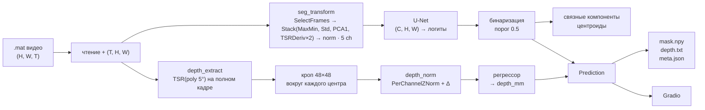

# Архитектура thermal-control

Задача — по ИК-термографическому видео оценить дефекты композита:
найти их на кадре (сегментация) и для каждого экземпляра предсказать
глубину залегания в миллиметрах (регрессия).

После переписывания проект больше не «слой данных на `main` + обучение на
ветках». Есть общий путь:

1. сырое `.mat`-видео сводится к одному формату;
2. временной куб `(T, H, W)` сжимается в многоканальную карту `(C, H, W)`
   одними и теми же трансформами на обучении и на инференсе;
3. U-Net выдаёт маску дефектов;
4. по связным компонентам маски режутся кропы, и отдельная CNN предсказывает
   глубину каждого дефекта;
5. результат уходит в файлы и в Gradio-интерфейс.

Прежний пакет `models/Thermal-Contrast` (4-канальный контраст + свой
train/eval/inference) свёрнут в `datasets/transforms` и
`models/segmentation`. Исторические эксперименты лежат в `experiments/`
и в пайплайн инференса не входят.

---

## Большая картина



Два каскада независимы по признакам. Сегментация — пять карт:
MaxMin · Std · PCA1 · TSRDeriv(1) · TSRDeriv(2) (max |p′|/|p″|).
Глубина — TSR-полином 5° + `AppendDerivatives` (`p5+d1`).

Глобальный регрессор на весь кадр не подходит: на одном снимке несколько
дефектов разной глубины, и один ответ усреднил бы их все. Поэтому глубина
считается **per-instance** — по кропу вокруг каждого найденного региона.

---

## Структура репозитория

```
datasets/                 слой данных + общие трансформы
  datasets.py             TermoDataset и варианты
  config.py               DatasetConfig из manifest.yaml
  transforms/             train = inference, numpy (T|C, H, W)
  datasets_list/          поддатасеты (gitignored *.mat/*.png)
    dataset_kaggle/       PVC, mat_key=imageArray
    dataset_tpu/          TPU, mat_key=data

models/                   рабочие сети и Lightning-обёртки
  segmentation/           U-Net, BCE+Dice, IoU/Dice, Lightning
  regression/             SmallCNN / timm-бэкбон, лоссы, Lightning
  pretraining/            MAE (черновик, закомментирован)

pipeline/                 инференс для downstream
  models.py               ThermalControlVideoPredictor, Prediction, Defect

web-frontend/             Gradio MVP
  app.py                  UI: .mat → overlay / таблица / каналы
  runner.py               загрузка чекпойнтов, отрисовка, save

experiments/              исторические прогоны, не продакшен-путь
  lstm/                   сегментация 14ch, multitask, EfficientNet
  regression/             регрессия глубины (TSR + кропы), Muon
  5th-polynom-exps/       классификация по коэффициентам полинома
  fourier-exps/           классификация по фазе FFT
  notebooks/              воспроизведение итераций

scripts/                  маски TPU, TIFF/видео, превью трансформов
docs/                     эта архитектура, планы, вопросы
```

Данные (`*.mat`, `*.png`, `runs/`, `*.pkl`) в git не входят.

---

## Слой данных

### Зачем манифест

На диске несколько разнородных съёмок. Kaggle хранит куб под ключом
`imageArray` (сырые отсчёты сенсора ~7700), TPU — под `data` (градусы ~25).
Маски — PNG с тем же stem, что у `.mat`. Чтобы не хардкодить пути и ключи,
каждый поддатасет самоописывается `manifest.yaml`; добавить набор — положить
папку с `data/`, `masks/` и манифестом.

```
datasets/datasets_list/
  <subdataset>/
    manifest.yaml
    <data.path>/*.mat
    <masks.path>/<stem><ext>
```

```yaml
name: TPUdataset
data:  { path: data,  file_pattern: ".mat", mat_key: "data", dtype: float32 }
masks: { path: masks, file_pattern: ".png" }
crop:  { x0: null, x1: null, y0: null, y1: null }
```

`crop` применяется **только если заданы все четыре** `x0,x1,y0,y1`. При
активном кропе по времени дополнительно режется `:1500` — без кропа каналы
идут целиком. Это историческое расхождение, его нужно помнить при сравнении
доменов.

Подробности полей — [datasets/README.md](../datasets/README.md).

### TermoDataset

Единый `torch.utils.data.Dataset` над несколькими подпапками.

```python
TermoDataset(root_dir, include=None, transform=None, standard_size=(256, 256))
```

- `include` — имена подпапок; `None` → все;
- `transform(data, mask) -> (data, mask)` — numpy, **до** тензора;
- `standard_size` — общий пространственный размер после трансформа.

Поток `__getitem__`:

```
loadmat[mat_key]                 (H, W, T) float32
Image.open(mask)                 (H, W)
_apply_crop                      если все 4 координаты
transpose                        (H, W, T) → (T, H, W)  ← контракт трансформов
transform(data, mask)            опционально
torch tensor
interpolate → standard_size      data: bilinear, mask: nearest
(data − mean) / (std + ε)        одно mean/std на весь тензор
return data, mask
```

Выход обучения: `data` — `(C, 256, 256)` (C = T, если трансформ не сжал
время), `mask` — `(256, 256)`.

Глобальная нормировка после трансформа — часть датасета, не трансформа.
Инференс через `ThermalControlVideoPredictor` **не** проходит через
`TermoDataset`: он вызывает `seg_transform` на уже подготовленном `(T, H, W)`
и сам не делает interpolate/z-score. Чтобы train и infer совпали, resize и
нормировку нужно либо включить в `Compose`, либо повторить снаружи.

### Другие датасеты

| класс | зачем |
|---|---|
| `TermoDataset` | сегментация, трансформ на `(T, H, W)` |
| `TermoRegressionDataset` | то же, но маска тоже z-score (карта глубины как таргет) |
| `TermoOversampledDataset` | длина × `mag_coeff`; трансформ только на «лишних» копиях |
| `TermoFrameDataset` | один элемент = один кадр; кэш полного `.mat` |

Все четыре сканируют `root_dir` одинаково. Разница — в `__getitem__`.

---

## Трансформы

Это ядро новой архитектуры: один numpy-интерфейс на обучение и инференс.

Контракт:

```python
class Transform:
    def __call__(self, data, mask=None) -> tuple: ...
    def out_channels(self, c_in: int) -> int: ...   # по умолчанию c_in
```

`data` — `ndarray` с каналами/временем в оси 0: сначала `(T, H, W)`, после
экстракторов — `(C, H, W)`. Маска — `(H, W)` или `None` (инференс).

### Композиция

| класс | роль |
|---|---|
| `Compose` | последовательность; `out_channels` прогоняет цепочку |
| `Stack` | конкатенация выходов нескольких экстракторов по оси 0 |
| `RandomChoice` | k случайных трансформа из списка (только аугментации) |

Типичная сегментационная цепочка (бывший Thermal-Contrast):

```python
from datasets.transforms import (
    Compose, Stack, SelectFrames, PercentileNorm,
    MaxMin, Std, PCA1, TSRDeriv,
)

seg_transform = Compose([
    SelectFrames(num_frames=128),
    Stack([MaxMin(), Std(), PCA1(), TSRDeriv(1), TSRDeriv(2)]),
    PercentileNorm(),
])
#  T,H,W  →  128,H,W  →  5,H,W  →  5,H,W в [0, 1]
```

Типичная цепочка глубины (как в `web-frontend/runner.py`):

```python
from datasets.transforms import Compose, Stack, TSR, PerChannelZNorm, AppendDerivatives

depth_extract = Compose([Stack([TSR(deg=5)])])          # полный кадр → (6, H, W)
depth_norm    = Compose([PerChannelZNorm(), AppendDerivatives(1)])  # кроп → 11 каналов
```

`TSR(5)` даёт 6 коэффициентов (`deg + 1`). `AppendDerivatives(1)` дописывает
первые разности по каналам: 6 + 5 = 11. Это режим `p5+d1` из регрессионных
экспериментов.

### Видео: SelectFrames

До экстракции выбрасываются кадры, которые ломают статистики:

- **вспышка** — кадр яркий *и* пространственно плоский. Фотовспышка засвечивает
  матрицу равномерно и стала бы `max(t)`, хотя дефектов в ней нет.
- **ведущие калибровочные** — серия с `t = 0`, у которой пространственный
  разброс сильно выше базового уровня до нагрева. Иначе `t₀` бессмысленен и
  канал `maxfirst` разрушается.

Пороги — доли амплитуды нагрева `p99(mean) − median(mean)`, а не абсолютные
единицы: одни числа работают и на сырых отсчётах Kaggle, и на градусах TPU.

Оставшиеся кадры равномерно субсэмплируются до `num_frames` (по умолчанию 64).
Если осталось меньше — берутся все.

### Экстракторы: (T, H, W) → (C, H, W)

| класс | C | формула / смысл |
|---|--:|---|
| `MaxMin` | 1 | `max(t) − min(t)` — классический тепловой контраст NDT |
| `MaxFirst` | 1 | `max(t) − t₀` — пик нагрева относительно холодного базового кадра |
| `Std` | 1 | σ по времени — насколько пиксель «шевелится» за прогон |
| `PCA1` | 1 | 1-я временная мода (power iteration, ~PCT). Сид — карта max−min; знак
  разворачивается до положительной корреляции с ней, иначе дефекты от видео
  к видео то светлые, то тёмные |
| `TSR(deg)` | deg+1 | коэффициенты полинома `log ΔT ≈ Σ cₖ (log t)ᵏ` на фазе остывания |
| `TSRDeriv(order, at)` | 1 или `len(at)` | производная TSR: при `at=None` (дефолт) — max \|p⁽ᵒʳᵈᵉʳ⁾\| по остыванию; иначе срезы в долях длины остывания |

**TSR подробнее.** Находится кадр пика (argmax средней яркости). База —
среднее по первой четверти до пика. `ΔT = max(T[peak:] − base, 1e-3)`.
Дальше `lstsq` по базису `{1, log t, …, (log t)^deg}` в лог-лог домене.
Глубина физически сидит в *форме* кривой остывания; полином 5° — стандарт
термографического TSR (thermographic signal reconstruction).

Порядок каналов в `Stack` = порядок экстракторов.

### Канальные: уже (C, H, W)

| класс | что делает |
|---|---|
| `PerChannelZNorm` | z-score независимо по каждому каналу `(mean/std по H,W)` |
| `PercentileNorm` | растяжение в `[0, 1]` по перцентилям (по умолчанию 1 % / 99 %) |
| `AppendDerivatives(order)` | дописывает `np.diff` по оси каналов `order` раз |

Перцентили, а не min/max: в кадре почти всегда есть оснастка/край горячее
образца; один такой пиксель сплющивает дефекты. Поканально, а не глобально:
`pca1` и разности температур живут в разных масштабах.

`PerChannelZNorm` на полном кадре и на кропе — разные статистики. В
продакшен-регрессии нормировка **per-crop**: сначала TSR на всём видео
(пик нагрева глобальный), потом z-score уже на вырезанном 48×48.

### Аугментации

`HorizontalFlip`, `VerticalFlip`, `Transpose`, `RandomRotate90` — пространственные,
синхронно крутят `data` (оси 1,2) и `mask` (оси 0,1). Вероятность `p`.
На инференсе не ставятся.

Старый `datasets/aug.py` — черновик тех же идей; канон теперь
`datasets/transforms/augment.py`.

---

## Модели

Пакет `models/` — то, чем пользуется новый код. Lightning-модули
подключают сеть + лосс + AdamW + cosine.

### Сегментация — `models/segmentation`

`UNetModel(in_channels=5, num_classes=1)` — классический 4-уровневый U-Net
(64→128→256→512, bottleneck 1024), skip-connections, выход `Conv2d 1×1`.
Вход `(B, C, H, W)`, выход логиты того же пространственного размера.

Лосс `BCEDiceLoss`: `bce_w · BCEWithLogits + dice_w · (1 − soft Dice)`.
Опциональный `pos_weight` для редких дефектов.

Метрики `compute_iou` / `compute_dice` — после sigmoid и порога 0.5,
среднее по батчу.

`SegmentationLightningModule`: общий `_shared_step` на train/val, логи
`train|val_{loss,iou,dice}`, `predict_step` возвращает вероятности.
Оптимизатор AdamW, CosineAnnealingLR до `0.05 · lr`.

### Регрессия — `models/regression`

`SmallCNN`: три `Conv-BN-ReLU-MaxPool` блока (16→32→64) + GAP + Linear →
скаляр (или `num_classes`).

`RegressionModel` — тонкая обёртка над любым бэкбоном (`timm.create_model`
с `num_classes=1` на инференсе). `forward` сжимает последний dim.

Лоссы в том же пакете заточены и под **порядковую классификацию** глубины
(исторический вариант A): `CostSensitiveCE` (CE + ожидаемая стоимость
ошибки по матрице расстояний классов), `QWKLoss` (квадратичная взвешенная
каппа). Чистая регрессия в экспериментах использует SmoothL1/Huber — он
живёт в `experiments/regression/losses.py`, не здесь.

`RegressionLightningModule`: train/val loss, на валидации ещё MAE и RMSE.

### Предобучение

`models/pretraining/mae.py` — набросок ViT-MAE (PatchEmbed, encoder/decoder).
Код закомментирован, в пайплайн не входит.

---

## Инференс-пайплайн

Всё, что нужно downstream-коду, собрано в `pipeline/models.py`.

### Сущности

```python
@dataclass
class Defect:
    x: int            # колонка центроида в исходных пикселях
    y: int            # строка
    depth_mm: float
    region_id: int

@dataclass
class Prediction:
    mask: np.ndarray          # (H, W) uint8 0/1
    defects: list[Defect]
    prob: np.ndarray          # (H, W) сырые вероятности
    size: tuple[int, int]     # (H, W) исходного видео
```

`Prediction.save(output_dir)` пишет:

- `mask.npy` — бинарная маска;
- `depth.txt` — строки `x y depth_mm` (заголовок в первой строке);
- `meta.json` — размер кадра и список дефектов.

### ThermalControlVideoPredictor

Конструктор принимает уже загруженные сети и готовые `Compose`:

```python
ThermalControlVideoPredictor(
    seg_model,          # nn.Module → логиты (1, 1, H, W) или (1, H, W)
    seg_transform,      # video (T,H,W) → channels (C,H,W)
    depth_model,        # nn.Module → скаляр на кроп
    depth_extract,      # полный кадр → TSR-карта (C,H,W)
    depth_norm,         # кроп (C,s,s) → (C',s,s)
    device=cpu,
    threshold=0.5,
    crop=48,
)
```

`predict(video)`:

1. **`_segment`** — `seg_transform(video)` → тензор → sigmoid → порог →
   `prob`, `mask`.
2. **`_crop`** — `ndimage.label` по маске; для каждой компоненты —
   центр масс; верхний левый угол окна `crop×crop`, зажатый в кадр.
3. **`_regress`** — TSR на *полном* видео (пик нагрева один на ролик);
   для каждого окна `depth_norm` на срезе; батч кропов → `depth_model`.
4. Сборка `Defect`: координаты — центр окна (`c0 + crop//2`, `r0 + crop//2`),
   не сырой центр масс (он может отличаться у края кадра).

Обёртка `predict_video(video, predictor, output_dir=None)` вызывает
`predict` и при необходимости `save`.

Видео на входе — numpy `(T, H, W)`. Чтение `.mat` пайплайн сам не делает
(закомментированный `predict_mat` опирался на удалённый `video_io`).
Снаружи: `scipy.io.loadmat` + transpose, либо ридер из скриптов.

---

## Веб-интерфейс

`web-frontend/` — Gradio MVP. Каталог с дефисом, поэтому запуск скриптом,
не как пакет:

```bash
THERMAL_SEG_CKPT=path/to/seg.pkl \
THERMAL_REG_CKPT=path/to/reg.pkl \
python web-frontend/app.py
```

UI: загрузка `.mat`, опциональный `mat_key`, порог бинаризации.
На выходе — overlay маски на канале max−min, таблица
`(region, x, y, depth_mm)`, галерея каналов / prob / кропов, файлы
`mask.npy`, `depth.txt`, `meta.json`.

`runner.py` повторяет ту же схему, что `ThermalControlVideoPredictor`
(связные компоненты → кроп 48 → TSR + per-crop norm + Δ → регрессор),
но сегментацию пока считает через старый `build_channels` /
`load_video_from_mat` из удалённого `models/Thermal-Contrast`. Канон для
нового кода — `pipeline.models.ThermalControlVideoPredictor` и трансформы
из `datasets.transforms`. Чекпойнт регрессии — pickle с полями
`model_name`, `in_channels`, `poly_degree`, `model_state` (timm-бэкбон,
голова на 1 выход).

---

## Обучение

Отдельного `train.py` в корне нет: сегментация и регрессия учатся через
Lightning-модули или через `experiments/`.

Минимальный каркас сегментации:

```python
from datasets.datasets import TermoDataset
from datasets.transforms import (
    Compose, Stack, SelectFrames, PercentileNorm,
    MaxMin, Std, PCA1, TSRDeriv,
    HorizontalFlip, VerticalFlip, Transpose, RandomRotate90, RandomChoice,
)
from models.segmentation.model import UNetModel
from models.segmentation.loss import BCEDiceLoss
from models.segmentation.lightning_module import SegmentationLightningModule

train_tf = Compose([
    SelectFrames(num_frames=128),
    RandomChoice([HorizontalFlip(), VerticalFlip(), Transpose(), RandomRotate90()], k=2),
    Stack([MaxMin(), Std(), PCA1(), TSRDeriv(1), TSRDeriv(2)]),
    PercentileNorm(),
])
ds = TermoDataset("datasets/datasets_list", transform=train_tf)
model = SegmentationLightningModule(UNetModel(in_channels=5), BCEDiceLoss())
```

Регрессия в экспериментах устроена иначе (и этот путь совпадает с
инференсом глубины):

1. `TermoDataset` отдаёт кадры 256×256.
2. TSR-признаки кэшируются в `.npy` на видео (`features_p5/`, `features_tpu/`).
3. По маске находятся связные компоненты; для каждой — кроп 48×48 и таргет
   в мм.
4. Сплит **по видео**, не по кропам (иначе утечка: соседние дефекты одного
   ролика в train и test).
5. Поканальная μ/σ **по домену** (kaggle и tpu в разных единицах).
6. Таргет — z-score по train; на метриках обратно в мм.

Таргеты по доменам:

- **kaggle** — серый уровень PNG → класс → глубина (5 дискретных значений
  5–25 мм после перевода см→мм);
- **tpu** — `depth_mm = gray / 255 * 6.1`; все блоки одного образца на
  одной глубине (таблица в `scripts/make_tpu_masks.py`).

Диапазоны почти не пересекаются (kaggle 5–25 мм, tpu 0.5–6.1 мм) — это
главная причина, почему нормировка и метрики считаются раздельно.

---

## Эксперименты (не продакшен)

Лежат рядом, чтобы не потерять выводы. Новый код их не импортирует.

| каталог | постановка | вход | вывод |
|---|---|---|---|
| `lstm/` | full-frame сегментация, затем multitask | 14 каналов: TSR-p5 + PCA/EOF + PPT-фаза + d² | IoU ~0.66 kaggle / ~0.72 tpu (EfficientNet-b0) |
| `regression/` | per-crop регрессия мм | TSR p5+d1, кроп 48 | MAE ~1.18 мм kaggle / ~1.73 мм tpu (Muon) |
| `5th-polynom-exps/` | классификация глубины по TSR | 6 (+ производные) каналов, кропы | порядковые классы |
| `fourier-exps/` | то же, но фаза rFFT | 8 низкочастотных фазограмм | сравнение с полиномом |
| `notebooks/` | воспроизведение итераций | — | — |

Итоги сегментации: [experiments/lstm/SEGMENTATION_EXPERIMENTS.md](../experiments/lstm/SEGMENTATION_EXPERIMENTS.md).
Итоги регрессии: [experiments/regression/RESULTS.md](../experiments/regression/RESULTS.md).
Физика признаков (PCA vs TSR vs FFT vs 3D-CNN): [docs/plans.md](plans.md).

Что из экспериментов вошло в архитектуру:

- per-instance кропы, а не глобальная голова глубины;
- TSR + первая производная как вход регрессора;
- сплит по видео;
- поканальная нормировка, у регрессии — ещё и per-crop / per-domain.

Что не вошло: 14-канальный full-frame U-Net, Attention-gate, boundary-loss,
классификация вместо регрессии, FFT-фаза как основной вход.

---

## Скрипты

| скрипт | роль |
|---|---|
| `scripts/make_tpu_masks.py` | PNG-маски глубины TPU из таблицы образцов и `base_mask` |
| `scripts/thermal_to_tiff.py` | кадр `.mat` → 32-bit float TIFF (реальные °C) |
| `scripts/thermal_to_video.py` | `.mat` → colormap mp4/gif |
| `scripts/export_transform_previews.py` | кривые и карты признаков в `transform_previews/` |

Превью (`A*` — кривые пикселя дефект/фон, `B*` — карты кадра) повторяют
формулы из `datasets/transforms/extract.py`.

---

## Как пользоваться

### Добавить датасет

Положить `datasets/datasets_list/<name>/{manifest.yaml, data/*.mat, masks/*.png}`.
Ключ массива в `.mat` — в `data.mat_key`. Код не меняется.

### Прогнать инференс

```python
import numpy as np
import torch
from datasets.transforms import (
    Compose, Stack, SelectFrames, PercentileNorm,
    MaxMin, Std, PCA1, TSRDeriv, TSR, PerChannelZNorm, AppendDerivatives,
)
from models.segmentation.model import UNetModel
from models.regression.model import RegressionModel
from pipeline.models import ThermalControlVideoPredictor, predict_video

seg = UNetModel(in_channels=5, num_classes=1)
# seg.load_state_dict(...)

depth = RegressionModel(...)   # timm / SmallCNN, in_chans=11 для p5+d1
# depth.load_state_dict(...)

predictor = ThermalControlVideoPredictor(
    seg_model=seg,
    seg_transform=Compose([
        SelectFrames(num_frames=128),
        Stack([MaxMin(), Std(), PCA1(), TSRDeriv(1), TSRDeriv(2)]),
        PercentileNorm(),
    ]),
    depth_model=depth,
    depth_extract=Compose([Stack([TSR(5)])]),
    depth_norm=Compose([PerChannelZNorm(), AppendDerivatives(1)]),
    device=torch.device("cpu"),
)

video = ...  # (T, H, W) float32
pred = predict_video(video, predictor, output_dir="out/")
# pred.mask, pred.defects, pred.prob
```

Размер `in_channels` сегментатора = `seg_transform.out_channels(0)`
(для Stack из пяти экстракторов это 5).
Размер входа регрессора = `depth_norm.out_channels(depth_extract.out_channels(0))`
(TSR-5 → 6, плюс Δ → 11).

### Окружение

Python ≥ 3.10, [uv](https://docs.astral.sh/uv/):

```bash
uv venv && source .venv/bin/activate
uv sync
uv pip install torch pytorch-lightning timm scikit-learn pyyaml pillow opencv-python matplotlib pandas
```

---

## Ограничения и ловушки

- **Train vs infer.** `TermoDataset` после трансформа делает bilinear resize
  и глобальный z-score. Предиктор этого не делает. Совпадение препроцессинга
  нужно собирать явно в `Compose` (или повторять снаружи).
- **Кроп `:1500`.** Срез по времени только при полном `crop` в манифесте.
- **Нормировка TermoDataset** — одно mean/std на тензор, не поканальная.
  Поканальность дают только `PerChannelZNorm` / `PercentileNorm`.
- **TPU-маски.** 18 видео, 2 уникальные геометрии: маска описывает образец,
  не ролик. Глубина одна на все блоки образца.
- **Kaggle-маски.** Мелкие 2×2 мм квадраты; тепловой след шире GT, поэтому
  IoU упирается в разметку раньше, чем в модель (Dice при этом выше).
- **`Prediction.to_dict`** сериализует дефект как `{x: y}`, без глубины —
  полноценная таблица только в `depth.txt`.
- **`TermoOversampledDataset.__len__`** умножает на `mag_coeff: float`.
- **web-frontend** ещё импортирует удалённый `models/Thermal-Contrast`
  (`channels`, `video_io`, `checkpoint`). Для нового кода используйте
  `pipeline` + `datasets.transforms`.
- **Импорты.** `datasets/datasets.py` делает `from config import DatasetConfig`
  (bare). Lightning-модули так же тянут `metrics` / `loss` из своей папки.
  Запуск — из каталога модуля или через `sys.path`.
- **MAE и `thermo/`** не в рабочем пути. `datasets/aug.py` — устаревший
  дубль трансформов.
